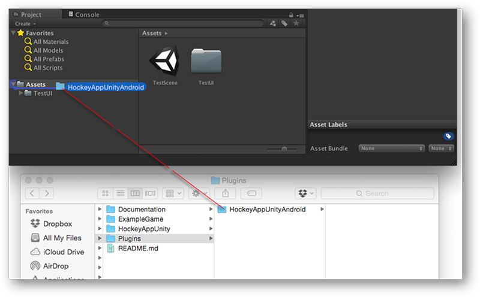
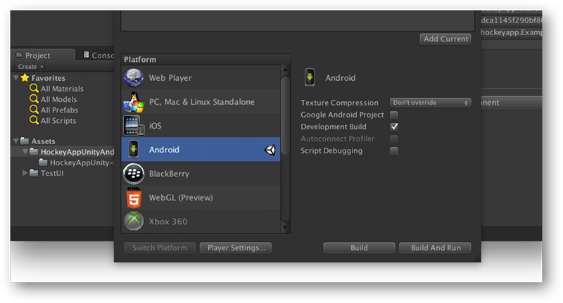

## Introduction

The HockeyAppUnity-Android plugin implements support for using HockeyApp in your Unity-Android builds. It easily lets you keep track of crashes that have been caused by your scripts or native Java code.

## Requirements (Version 1.0.5)

* Unity 5.0 or newer (SDK versions with Unity 4 support can be found at the [Unity Asset Store](https://www.assetstore.unity3d.com/en/?gclid=CO) or by switching to the appropriate release branch on GitHub).
* Android 2.1 or newer.

###Changelog:###

1.0.5:

- Update HockeApp SDK Android version to 3.5
- Fix warnings
- Extend demo project: Add handled managed exception

## Installation & Setup

The following steps illustrate how to integrate the HockeyAppUnity-Android plugin:

### 1) Import plugin
Copy the **HockeyAppUnityAndroid** folder into the **Assets** directory of your Unity project
Unity

### 2) Modify AndroidManifest.xml
Change the value for **package** inside the AndroidManifest.xml (*Assets/HockeyAppUnityAndroid*) to the package identifier of your project.

### 3) Create plugin-GameObject
Create an empty game object (*GameObject -> Create Empty*) and add the **HockeyAppAndroid.cs** as one of its components.

Select the game object in the **Hierachy** pane and fill in the App ID provided by HockeyApp (Inspector window). You will also have to enter a package identifier: Make sure that **Package ID** equals the package name of your HockeyApp app. If you have your own server instance, please type in its url (**Server URL**). In most cases this field should be left blank.

If you want to get more precise information about exceptions in your Unity scripts you can also check the **Exception Logging** property. 

The **Auto Upload** option defines if the crash reporting feature should send crash reportings automatically without asking the user. If users should be informed about app updates from inside your app, please make sure that **Update Manager** is checked, too.

### 4) Configure build settings
You are now ready to build the project: Select **File -> Build Settings...** and switch to **Android** in the platform section. Check **Development Build** (see Build Settings section). 

That's it: Build your app / Android project as usual.

## Build Settings ##

The **Development Build** option affects the exception handling in C#. You will get a crash report in any case, but the data quality differs. It is recommend to enable it for alpha and beta builds, but to disable this option for production.

**Disabled Development Build**:
	
	IndexOutOfRangeException: Array index is out of range.
 		at (wrapper stelemref) object:stelemref (object,intptr,object)
 		at TestUI.OnGUI ()

**Enabled Development Build**:

	IndexOutOfRangeException: Array index is out of range.
 		at (wrapper stelemref) object:stelemref (object,intptr,object)
 		at TestUI.OnGUI () (at /Users/name/Documents/Workspace/HockeyAppUnity-Android/ExampleGame/Assets/TestUI/TestUI.cs:67)
 		
## Examples

### Feedback Form

The HockeyApp feedback form can be presented as follows:
	
	// Get the current activity object
	AndroidJavaClass unityPlayer = new AndroidJavaClass("com.unity3d.player.UnityPlayer"); 
	AndroidJavaObject currentActivity = unityPlayer.GetStatic<AndroidJavaObject>("currentActivity"); 
	
	// Get the plugin
	AndroidJavaClass plugin = new AndroidJavaClass("net.hockeyapp.unity.HockeyUnityPlugin"); 
	
	// Show the feedback form
	plugin.CallStatic("startFeedbackForm", <YOUR-HOCKEY-APP-ID> , currentActivity);

## Licenses

The Hockey SDK is provided under the following license:

    Copyright (c) 2011 - 2015 HockeyApp, Bit Stadium GmbH.

    Permission is hereby granted, free of charge, to any person
    obtaining a copy of this software and associated documentation
    files (the "Software"), to deal in the Software without
    restriction, including without limitation the rights to use,
    copy, modify, merge, publish, distribute, sublicense, and/or sell
    copies of the Software, and to permit persons to whom the
    Software is furnished to do so, subject to the following
    conditions:

    The above copyright notice and this permission notice shall be
    included in all copies or substantial portions of the Software.

    THE SOFTWARE IS PROVIDED "AS IS", WITHOUT WARRANTY OF ANY KIND,
    EXPRESS OR IMPLIED, INCLUDING BUT NOT LIMITED TO THE WARRANTIES
    OF MERCHANTABILITY, FITNESS FOR A PARTICULAR PURPOSE AND
    NONINFRINGEMENT. IN NO EVENT SHALL THE AUTHORS OR COPYRIGHT
    HOLDERS BE LIABLE FOR ANY CLAIM, DAMAGES OR OTHER LIABILITY,
    WHETHER IN AN ACTION OF CONTRACT, TORT OR OTHERWISE, ARISING
    FROM, OUT OF OR IN CONNECTION WITH THE SOFTWARE OR THE USE OR
    OTHER DEALINGS IN THE SOFTWARE.

The following classes are based on code from the project 
android-remote-stacktrace:

* Constants
* CrashManager
* ExceptionHandler

Source: http://code.google.com/p/android-remote-stacktrace/

The original license of these classes is:

    Copyright (c) 2009 nullwire aps

    Permission is hereby granted, free of charge, to any person
    obtaining a copy of this software and associated documentation
    files (the "Software"), to deal in the Software without
    restriction, including without limitation the rights to use,
    copy, modify, merge, publish, distribute, sublicense, and/or sell
    copies of the Software, and to permit persons to whom the
    Software is furnished to do so, subject to the following
    conditions:

    The above copyright notice and this permission notice shall be
    included in all copies or substantial portions of the Software.

    THE SOFTWARE IS PROVIDED "AS IS", WITHOUT WARRANTY OF ANY KIND,
    EXPRESS OR IMPLIED, INCLUDING BUT NOT LIMITED TO THE WARRANTIES
    OF MERCHANTABILITY, FITNESS FOR A PARTICULAR PURPOSE AND
    NONINFRINGEMENT. IN NO EVENT SHALL THE AUTHORS OR COPYRIGHT
    HOLDERS BE LIABLE FOR ANY CLAIM, DAMAGES OR OTHER LIABILITY,
    WHETHER IN AN ACTION OF CONTRACT, TORT OR OTHERWISE, ARISING
    FROM, OUT OF OR IN CONNECTION WITH THE SOFTWARE OR THE USE OR
    OTHER DEALINGS IN THE SOFTWARE.

Contributors:

* Mads Kristiansen, mads.kristiansen@nullwire.com
* Glen Humphrey
* Evan Charlton
* Peter Hewitt
